# Нейронные сети не могут обобщать периодические зависимости. Как это исправить?

https://web.habrastorage.org/en#board

## Мотивация
Данная статья это частичный перевод [статьи](https://arxiv.org/abs/2006.08195) с моими экспериментами и дополнениями.

Пока крутые ребята создают GigaChat вернемся к базе. 
Изучая нейронные сети все глубже сталкиваешься с тем, что не ко всем задачам применимы полносвязные глубокие нейронные сети с класическими слоями Linear и слоями активации Relu, Sigmoid, Than и их вариации. Почему не используют остальные функции в качестве активации например периодические?

### Периодические функции это естественный процесс
В целом, периодические функции являются одной из самых основных функций, важных для человеческого общества и естествознания: суточные и годовые циклы в мире диктуются периодическими движениями солнечной системы.
Человеческому организму присущи биологические часы, которые носят периодический характер, количество пассажиров в метро меняется ежедневно , а фондовый рынок, курс биткоина это все в своем роде периодические последовательности. 
Мировая экономика также следует сложным и накладывающимся друг на друга циклам разных периодов, интересный видеоролик на эту тему есть у [Ray Dalio](https://www.youtube.com/watch?v=xguam0TKMw8).


Во многих научных сценариях мы хотим смоделировать периодическую систему, чтобы иметь возможность предсказать будущую эволюцию, основываясь на текущих и прошлых наблюдениях. В то время как глубокие нейронные сети являются отличными инструментами для апроксимации. Можно сказать с натяжкой, что они "интерполируют" между существующими данными. Поэтому их реализация плохо подходит для экстраполяции, то есть они не могут обобщить зависимость, особенно периодическую на известном распределении данных и применть те-же правила, патерны в тех местах где нет обучающих данных.  

Если мы заранее знаем, что задача является периодической, мы можем легко решить ее, помощью пребразования Фурье. Однако во многих ситуациях мы априори не знаем, является ли проблема линейно угловой (Relu), периодической или содержит периодический компонент. В таких случаях важно иметь универсальную модель, которая была бы достаточно гибкой для моделирования как периодических, так и непериодических функций.

# Расмотрим теоретическую часть, на простых функциях
## Применение стандартных подходов

Сгенерируем тренировочные и валидационные данные тривальных функций
y=x, y=sin(x), y=tahn(x), y=x^2  
Диапазон train data x=[-20;-4] and [4:20]  
Пробел (отсутствие данных) в  train data x [-4;4] поможет иследовать способность сети к **интерполяции**  
Диапазон valid data x=[-60;60] валидационная data взята так чтоб посмотреть как себя поведет нейронная сеть на тех диапазонах, где обучающих данных в принципе нет, с помощью этого иследуем **эксторпаляцию**.

### Code gen data:
```python 
import torch
import matplotlib.pyplot as plt
import matplotlib

class Gen_data:
    def __init__ (self, func, ydown_scale, yup_scale ):
        # Data for train
        x_train = torch.rand(700)
        x_train = x_train * 40.0 - 20.0
        
        self.x_train = x_train[ (x_train <= -4) | (x_train >= 4) ] 
        self.y_train = func(self.x_train)
        
        # Validate data
        self.x_val = torch.linspace(-60, 60, 600)
        self.y_val = func(self.x_val)
        
        # For correct view plottig data
        self.ydown_scale = ydown_scale
        self.yup_scale   = yup_scale

    
    def get_train_unsqueeze(self):
        return torch.unsqueeze(self.x_train, 1), torch.unsqueeze(self.y_train, 1)
    
    def get_val_unsqueeze(self):
        return torch.unsqueeze(self.x_val, 1), torch.unsqueeze(self.y_val, 1)

def plot_initdata(data):
    # generate data
    x_train = data.x_train
    y_train = data.y_train

    x_val = data.x_val
    y_val = data.y_val

    # Plot data
    plt.scatter(x_train.numpy(), y_train.numpy(), s=20, color = "purple", label='Train data')
    plt.plot(x_val,y_val, 'b-', label='Valid data')
    plt.title('$y = x$');

    plt.legend(loc='upper left')
    plt.xlabel('$x$')
    plt.ylabel('$y$')
```

Сами графики:
### code y=x
```python
# Define function
line_func=torch.clone
line_data=Gen_data(line_func, -65,65)
plot_initdata(line_data)
```
### график y=x
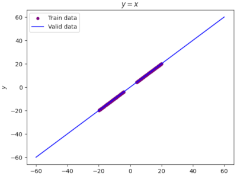

### code y=sin(x)
```python
matplotlib.rcParams['figure.figsize'] = (30.0, 5.0)
sin_data = Gen_data(torch.sin, -4,4)
plot_initdata(sin_data)
```
### график y=sin(x)
.png)
### code y=tahn(x)
```python
matplotlib.rcParams['figure.figsize'] = (20.0, 5.0)
tanh_data = Gen_data(torch.tanh, -2,2)
plot_initdata(tanh_data)
```
### график y=tahn(x)
.png)

### code y=x**2
```python
matplotlib.rcParams['figure.figsize'] = (20.0, 10.0)
# Define function
def parabola(x_input):
    return torch.pow(x_input, 2)
parb_data = Gen_data(parabola,-20,400)

plot_initdata(parb_data)
```
### график y=(x)**2
**2.png)

### Создадим  нейронную сеть
Создадим однослойную полносвязную нейронную сеть с 1 скрытым слоем из 512 нейронов и активационным слоем Relu
#### code pytorch Net
```python
import torch.nn as nn
import torch

class Net(torch.nn.Module):
    def __init__(self, n_hidden_neurons):
        super().__init__()
        # YOUR CODE HERE
        self.fc1 = nn.Linear(1, n_hidden_neurons)
        self.act_relu = nn.ReLU() 
        self.fc2 = nn.Linear(n_hidden_neurons, 1)
        pass

    def forward(self, x):
        x = self.fc1(x)
        x = self.act_relu(x)
        x = self.fc2(x)
        return x

def loss(pred, target):
    squares = (pred - target)**2
    return squares.mean()
```

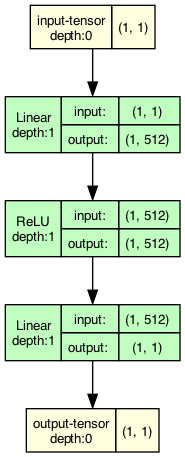


## Будем тренировать данную сеть на наших заготовленных данных:

### Результат на функции y=x
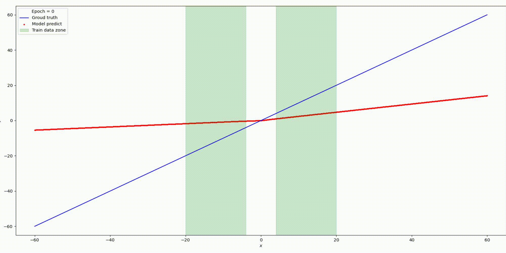


### Результат на функции y=sin(x)


### Результат на функции y=tanh(x)
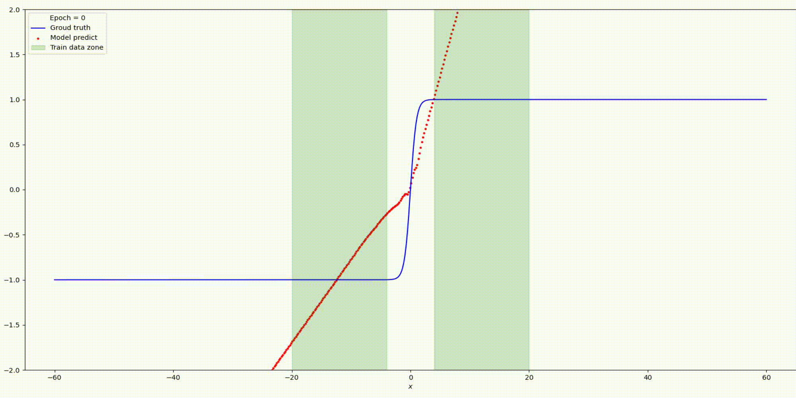

### Результат на функции y=parab(x)

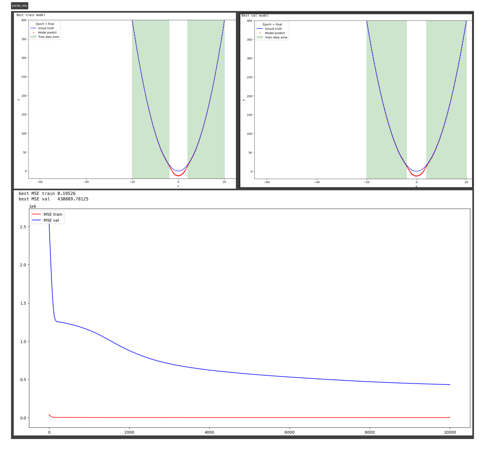
Существуют некоторые предыдущие методы, предлагающие использовать функции периодической активации (Fourier neural networks). В данном подходе предлагается использовать периодические функции, sin(x) и cos(x), или их линейные комбинации в качестве функций активации. Однако такие функции активации очень трудно оптимизировать из-за большого вырождения локальных минимумов и экспериментальные результаты показывают, что использование sin в качестве функции активации работает плохо, за исключением очень простых моделей и что оно не может конкурировать с функциями активации на основе ReLU в стандартных задача.

Для начала вспомним как выглядит функция активации Relu:

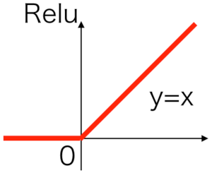   
   
В статье https://arxiv.org/pdf/2006.08195.pdf приводятся две теоремы тк они подобны приведу одну.
 ## Теорема: 
Расмативая сети с прямой связью  f(relu(x)) с произвольной но фиксированной глубиной и шириной d_1, .... d_h+1
 $$\lim_{z\to\infty} || f_{ReLU}(zu)-zW_{u}u-b_{u}||_{2}=0$$
 где z есть вещественный скаляр, u - любой единичный вектор размерности d1 а Wu ∈ Rd1×dh - постоянная матрица, зависящая только от u.
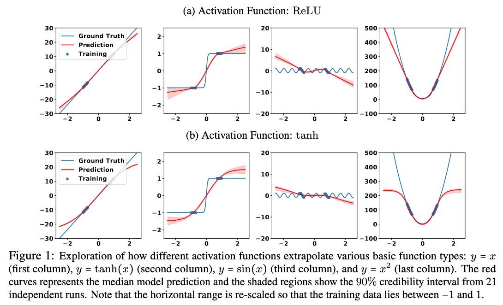


Приведенная выше теорема гласит, что любая полносвязная нейронная сеть с активацией ReLU сходится к линейному преобразованию W*u в асимптотическом пределе и это экстраполированное линейное преобразование зависит только от u. Смотрите иллюстрацию.  
Так-же, мы имеем понимание, что такая простая однослойная нейронная сеть Linear + Relu, при достаточном количестве нейронов, может приблизить с любой точностью, любую послеовательность данных.

Как мы увидели в предыдущем разделе, выбор функций активации играет решающую роль в  интерполяции и экстраполяции в нейронных сетях и такие свойства интерполяции
и экстраполяции, в свою очередь, влияют на обобщающие способности сети.

### Мотивация выбора периодичной функции активации.  
На ум сразу приходит взять в качестве активационной функции y=sin(x) или y=cos(x).  
  

Однако проблема этих функций заключается не в их способности к обобщению, а в их оптимизации. На самом деле, sin не является монотонной функцией. Использование sin в качестве функции активации создает бесконечно много локальных минимумов в решениях (поскольку сдвиг "значения активации" на 2π дает та же функция), что затрудняет оптимизацию sin.  
То есть нам нужна какая-то модифицированная sin(x) например наклонная функция, с каким-то обучающимся параметром.
$$\Large {Snake}_a:=x+\frac{1}{a} \sin ^2(a x)$$
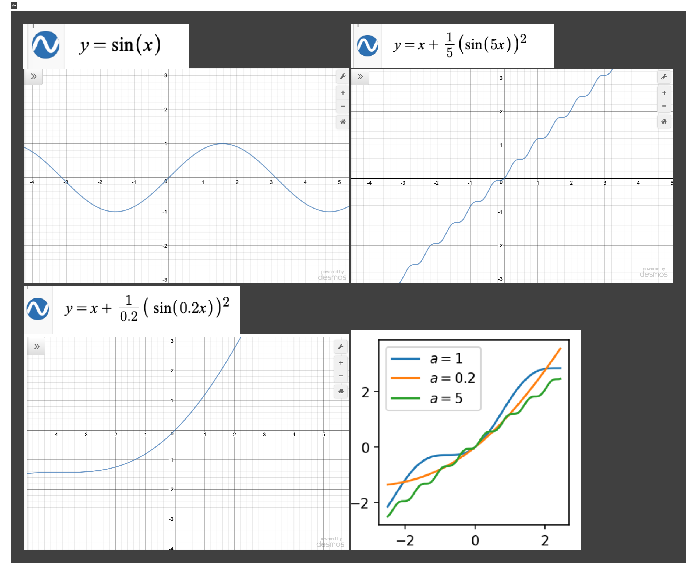

Реализацию данной функции в PyTorch позаимствовал в [репозитории EdwardDixon](https://github.com/EdwardDixon/snake/tree/master).
## Имплеминтируем в pytorch:
```python
import torch 
from torch import nn, sin, pow
from torch.nn import Parameter
from torch.distributions.exponential import Exponential

class Snake(nn.Module):
    '''         
    Implementation of the serpentine-like sine-based periodic activation function:
    .. math::
         Snake_a := x + \frac{1}{a} sin^2(ax) = x - \frac{1}{2a}cos{2ax} + \frac{1}{2a}
    This activation function is able to better extrapolate to previously unseen data,
    especially in the case of learning periodic functions

    Shape:
        - Input: (N, *) where * means, any number of additional
          dimensions
        - Output: (N, *), same shape as the input
        
    Parameters:
        - a - trainable parameter
    
    References:
        - This activation function is from this paper by Liu Ziyin, Tilman Hartwig, Masahito Ueda:
        https://arxiv.org/abs/2006.08195
        
    Examples:
        >>> a1 = snake(256)
        >>> x = torch.randn(256)
        >>> x = a1(x)
    '''
    def __init__(self, in_features, a=None, trainable=True):
        '''
        Initialization.
        Args:
            in_features: shape of the input
            a: trainable parameter
            trainable: sets `a` as a trainable parameter
            
            `a` is initialized to 1 by default, higher values = higher-frequency, 
            5-50 is a good starting point if you already think your data is periodic, 
            consider starting lower e.g. 0.5 if you think not, but don't worry, 
            `a` will be trained along with the rest of your model
        '''
        super(Snake,self).__init__()
        self.in_features = in_features if isinstance(in_features, list) else [in_features]

        # Initialize `a`
        if a is not None:
            self.a = Parameter(torch.ones(self.in_features) * a) # create a tensor out of alpha
        else:            
            m = Exponential(torch.tensor([0.1]))
            self.a = Parameter((m.rsample(self.in_features)).squeeze()) # random init = mix of frequencies

        self.a.requiresGrad = trainable # set the training of `a` to true

    def forward(self, x):
        '''
        Forward pass of the function.
        Applies the function to the input elementwise.
        Snake ∶= x + 1/a* sin^2 (xa)
        '''
        return  x + (1.0/self.a) * pow(sin(x * self.a), 2)
```

### Сама нейронная сеть c функцией Snake:
```python
import torch.nn as nn
# from activations_snake import Snake

class SnakeNet(torch.nn.Module):
    def __init__(self, n_hidden_neurons,alpha):
        super().__init__()
        self.fc1 = nn.Linear(1, n_hidden_neurons)
        self.act_snake = Snake(n_hidden_neurons, alpha) 
        self.fc2 = nn.Linear(n_hidden_neurons, 1)
        pass

    def forward(self, x):
        x = self.fc1(x)
        x = self.act_snake(x)
        x = self.fc2(x)
        return x

    
def loss(pred, target):
    squares = (pred - target)**2
    return squares.mean()
```

## Parametrs
n_hidden_neurons=512, alpha=20, epochs=20000, lr= 0.001.
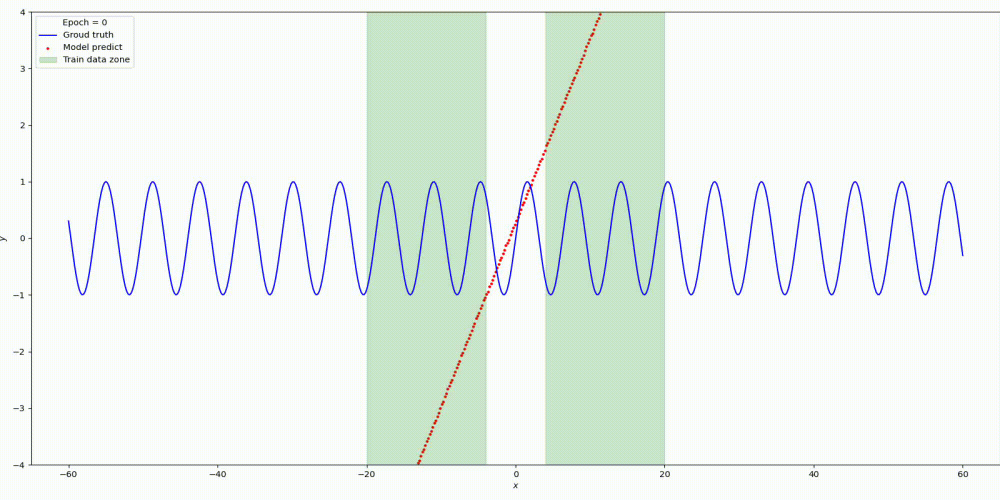


Изменим гипер-параметры
n_hidden_neurons=5, alpha=2, epochs=1500, lr= 0.0001.

Вот что получилось  


Попробуем применить туже сеть с активацией "Snake" к параболе.

Видим что происходит апроксимация только в районе распределения тренировочных данных, за границами обобщающие спопосбости сети отсутстивуют.  
Изменим конфигурацию добавив Relu + Linear.
Архитектура сети:
Linear -> Snake  ->  Linear -> ReLU -> Linear

Посмотрел как ведет себя модель за пределами тренировочных данных, не все так хорошо. На этом я остановлюсь с простыми функциями
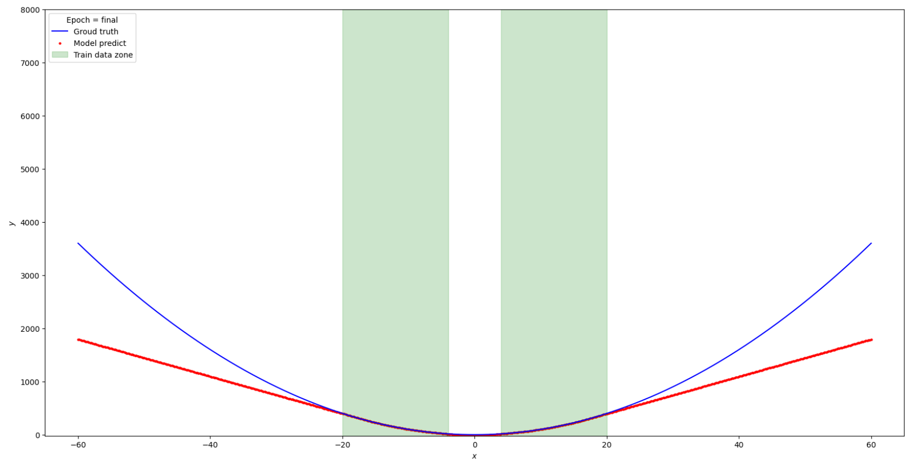


Сравним результаты Relu vs Snake на функции y=sin(x)
|                                  |  Relu neuron=500   | Snake neuron=4, alpha=2 |
|--------------------|--------------------|---------------------------|
|     best MSE val       |            0.49617         |               0.00119                 |

### Вывод из эксперементов с простыми функциями:
	Данная архитектура сети основанная на простых слоях Linear + Relu способна находить только  периодические зависимости в пределах существующего диапазона тренировочных данных. И при достаточном колличестве нейронов и глубине самой сети в теории может апроксимировать любую последовательность. 
    Но если в данных появляется периодическая компонента то Linear + Relu ломается на этом и никак не может обобщать периодические зависимости в местах пространсва где данные отсутсвуют - тоесть экстаополировать, а в местах где данные прирываются Relu соединяет по прямой тупо "интерполирует". Tahn или Sigmoid могут вносить некоторую гладкость но так-же не улавливают периодичность данных.
    Такое-же обобщение  работает для фкнкций активации Sigmoid() Tahn() Swish() и Leaky-ReLU() подобным образом как Relu.
	В отличии от классических функций активации, функция Snake() может обобщать тренировочные данные и правильно эксторпалировать, а значит ее можно использовать в большем спектре задачь.

### Перейдем к реальным задачам:
Пытался воспроизвести и улучшить задачу, расматирваемую в даном [репозитории](https://github.com/EdwardDixon/snake)  
Задача из категории time-series, необходимо предстказать максимальную температуру на осовании данных метео станции: давления, влажности, минимальной темпреатуры и еще ряда параметров. 
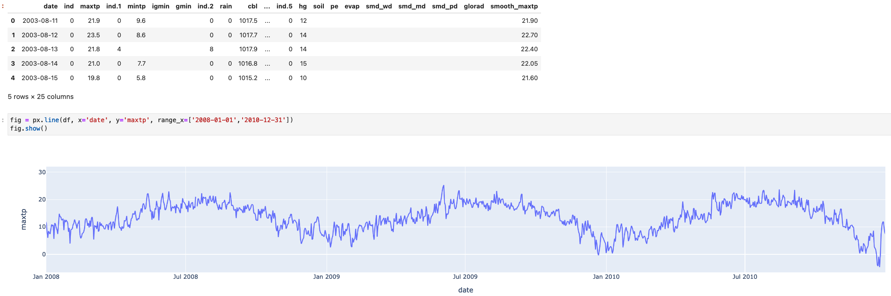
Я поигрался с разными конфигурациями сети и потюнил параметры.

На реальных данны получить каких-то выдающийхся результатов не вышло : (.

### Решил найти еще задачу, с периодическими time series данными.
[репозиторий](https://github.com/pratha19/Hourly_Energy_Consumption_Prediction/)  
**Формулировка проблемы:**  
Электроэнергетическим компаниям необходимо заранее тщательно спланировать распределение генерирующих единиц на своих электростанциях в соответствии с  потребностями.  Тк, если спрос превышает выработку, это может привести к  отключениям электроэнергии, с другой стороны, если выработка выше чем спрос, дополнительная электроэнергия будет потрачена впустую.

Таким образом, для коммунальных служб очень важно иметь прогноз потребления энергии, чтобы оптимизировать ресурсы. Прогноз на год, месяц или день вперед может помочь коммунальным службам планировать работу => фин.эффект.

Данные собранны за последние 4-10 лет:  
target = количество потребления электроэнергии.  
features = дата, праздник-выходной/ рабочий день, данные метостанции - темература, влажность, дневное повышение температуры, понижение. Потребление AC - кондиционера.

У авторов этой задачи и данных есть свои неплохие решения задачи на градиентном бустинге, деревьях.

Мое решение с помощью сети:
Собрал обычную однослойную сеть без активации, по сути это линейная регрессия в импементации торча. В качестве функции ошибки выбрал MSE-Loss.

```python
class Net_Line_regres(torch.nn.Module):
    def __init__(self, input_feature): #  
        super().__init__()
        self.fc1 = nn.Linear(input_feature, 1) 
    def forward(self, x):
        x = self.fc1(x)
        return x
```
И однослойная сеть  с функцией активации Snake

```python
class Net_Snake(torch.nn.Module):
    def __init__(self, input_feature, alpha): 
        super().__init__()
        self.fc1 = nn.Linear(input_feature, 1) 
        self.act_snake = Snake(1, alpha)
    def forward(self, x):
        x = self.fc1(x)
        x = self.act_snake(x)
        return x
```  
Как не бился с данными сетями, не тюнил, не переСтекивал разные слои с разными количеством нейронов, разными активациями Relu и не только, ничего дельного не получилась, даже визуально на лучших моделях достаточно большая ошибка.


Рузультаты сети Net_Line_regres:  
Loss  = 229201.29  
RMSE  =  466.84  
MAPE = 16.2%  


Рузультаты сети Net_Snake:  
Loss  = 226652.28  
RMSE  =  463.19  
MAPE = 15.4%  

А теперь достаем старый-добрый sk-learn, берем LinearRegression и пишем две строчки кода fit, predict.  
Даже визуально видно, что модель обучилась достаточно хорошо.


Рузультаты sklearn LinearRegression:   
RMSE  =  254.93  
MAPE = 8.38%


### Далее будут основные [выдержки из статьи](https://arxiv.org/abs/2006.08195)


В этом разделе мы демонстрируем широкую применимость Snake. Мы начинаем со стандартной задачи классификации изображений, где показано, что Snake конкурирует с популярными функциями активации, показывая, что Snake можно использовать в качестве общей функции активации. Затем мы сосредотачиваемся на задачах, в которых, как мы ожидаем, Snake будет очень полезен, включая прогнозирование температуры и финансовых данных.

## Классификация изображений:
Обучаем ResNet-18, примерно с 10 миллионами параметров, на стандартном данных CIFAR-10 - это задача классификации изображений размером 32 × 32 пикселя по 10 классам
  

Наша реализация воспроизводит стандартную производительность
ResNet18 на CIFAR-10, точность на тесте составляет около 92-93%. Этот эксперимент предназначен для проверки того, подходит ли Snake как универсальный инструмент для стандартных и крупномасштабных задач, с которыми приходится часто сталкиваться при машинном обучении.

Мы также сравним этот результат с другими стандартными или недавно предложенными функциями активации, включая Tanh, ReLU, Leaky−ReLU, Swish и sin.  
  
Мы видим, что функция активации sin демонстрирует те же результаты, что и tanh. В то время как Snake демонстрирует сравнительную производительность ReLU и
Leaky−RelU как в скорости обучения, так и в точности. Это указывает на то что в каких-то обобщеных задачах ReLU может быть замена на Snake  
**Мой комментарий:** в статье не приводится как конкретно они изменили архитектуру ResNet18, возможно они заменили Relu, а может быть заменили Relu + дополнительно еще что-то добавили, не понятно.

## Прогнозирование температуры атмосферы  и температуры тела человека.

Для иллюстрации мы сначала покажем два реальных применения нашего метода для прогнозирования температуры атмосферы острова и температуры человеческого тела. Это может быть очень важно для медицинского применения. Известно, что многие болезни и эпидемии имеют сильную корреляцию с температурой атмосферы, такие как атипичная пневмония и нынешний кризис COVID-19, который закончился 5 мая 2023 согласно [декларации WHO](https://www.reuters.com/business/healthcare-pharmaceuticals/covid-is-no-longer-global-health-emergency-who-2023-05-05/).Следовательно, возможность точного моделирования температуры может быть важна для более эффективной борьбы.

## Прогнозирование температуры атмосферы.
Начнем с тестирование нейронной сети с двумя
скрытыми слоями (оба по 100 нейронов) для регрессии изменения температуры на Минамиторисиме, острове к югу от Токио (долгота: 153,98, широта: 24,28)3. Данные представляют собой среднюю недельную температуру после апреля 2008 года, и результаты показаны на рис. 6а. Мы видим, что модели, основанные на tanh и ReLU не оптимизируют эту задачу и не делают значимой экстраполяции а модель на основе Snake успешно оптимизирует задачу и выполняет значимую экстраполяцию с правильными периодами. Мы видим, что сеть на базе активации Snake сводит Loss до 0 в то время как Relu, Tanh выходят на плато около 0.01 и дальнейшего уменьшения не происходит. 


### Прогнозирование температуры человека
Температура человеческого тела. Моделирование температуры человеческого тела также может быть важным, например признак повышение температуры  как один из наиболее важных симптомов, указывающих на инфекционное заболевание, включая COVID19 . Описание эксперимента. Мы используем нейронную сеть прямого действия с 2 скрытыми слоями (оба содержат по 64 нейрона) для регрессии температуры человеческого тела. Данные были получены от анонимного участника в течение 10-дневного периода в апреле 2020 года, всего 25 измерений. Хотя этот эксперимент также является рудиментарным по своей природе, он отражает множество препятствий. В ходе эксперемента столкнулись с такими проблемами, как очень ограниченный (всего 25 измерений) набор данных. Так-же стоит отметить что, эксперемент проводился через нерегулярные промежутки времени.  
Цель этой задачи - спрогнозировать температуру тела на каждый час.  Здесь нас нет тестового сета для решения этой задачи, поскольку весьма маловероятно, что модель правильно спрогнозирует решение этой задачи из-за больших колебаний температуры человеческого тела. На самом деле, у нас есть некоторые базовые знания о температуре тела. 
Например, температура должна находиться в разумных пределах от 35,5 до 37,5 градусов Цельсия и по сути, именно в этом диапазоне находятся все точки тренировки. Как минимум, модель должна подчиняться этому правилу, и достаточно хорошо обученная модель также должна обнаруживать колебания в течении дня когда мы спим и активничаем. 
Однако tanh или ReLU не могут ограничить температуру до диапазон 35,5 и 37,5 градуса. Обе исходные линии экстраполируются до уровня выше 39 градусов через 20 дней после
выборки train-set. Напротив, обучение со Snake в качестве функции активации научило подчиняться некоторым априори известным правилам.


### Прогнозирование фондового индекса Wilshire 5000  
Постановка проблемы. Глобальная экономика - это еще одна область, где может происходить квазипериодическое поведение.
На микроскопическом уровне экономика колеблется сложным, непредсказуемым образом; на
макроскопическом уровне глобальная экономика следует 8-10-летнему циклу, который переходит между периодами роста и рецессии. В этом разделе мы сравниваем различные модели для прогнозирования общей рыночной капитализации США, измеряемой с помощью индекса полной рыночной капитализации Wilshire 5000  (также провели этот же эксперимент с хорошо известным индикатором Buffet, который рассматривается как сильный индикатор для прогнозирования
национальной экономической тенденции ; мы также видим аналогичные результаты). Для обучения мы берем ежедневные данные из с 01-01-1995 по 31-01-2020, в общей сложности около 6300 пунктов, время окончания намеренно выбрано таким образом, чтобы оно наступило до того, как COVID19 начнет оказывать влияние на мировую экономику . Мы используем данные периода от 01-02-2020 до 31-05-2020 в качестве тестового сета. Примечательно, что тестовый набор отличается от обучающего несколькими значимыми факторами. Происходит рыночный спад, называемый черным четвергом (см. рис.);  общая тенденция носит рецессивный характер (рыночная
капитализация в среднем снижается). Интересно посмотреть, предсказуем ли медвежий тренд в этот период без влияния COVID19. Для методов, основанных на нейронных сетях, мы используем 4-слойную полносвязную сеть с 1 → 64 → 64 → 1 скрытыми нейронами, с указанной функцией активации, мы отмечаем, что ни одна функция активации, кроме Snake, не может быть оптимизирована до сведения функции loss практически в 0 при обучении. 
| Method        | MSE on Test Set |
|---------------|-----------------|
| ARIMA (2,1,1) | 0.0215±0.0075   |
| ARIMA (2,2,1) | 0.0306±0.0185   |
| ARIMA (2,2,1) | 0.0282±0.0167   |
| ARIMA (2,1,2) | 0.0267±0.0154   |
| ReLU DNN      | 0.0113±0.0002   |
| Swish DNN     | 0.0161±0.0007   |
| sin + cos DNN | 0.0661±0.0936   |
| sin DNN       | 0.0236±0.0020   |
| **Snake**         | **0.0089±0.0002**   |


Результаты: Смотрите таблицу выше, мы видим, что предложенный метод значительно превосходит конкурентовв прогнозировании рыночной стоимости на период 2020-2021 годов. Мы фокусируемся на сравнении с ARIMA, традиционным и стандартным методом в экономике и
прогнозировании цен на акции. Смотрите рисунок 8. Мы отмечаем, что ARIMA предсказывает растущую экономику, Snake предсказывает рецессивную экономику начиная с 2020-2021 годов. Фактически, для всех методов, приведенных в таблице 2, предлагаемый метод является единственным методом, который предсказывает спад во время тестирования и после его завершения период, мы предполагаем, что это связано с тем, что предлагаемый метод является единственным методом, который учит улавливать долгосрочные экономические циклы в тренде. Кроме того,интересно, что модель предсказывает рецессию, не предсказывая сильного обвала рынка. Это может свидетельствовать о том, что обвал рынка вызван влиянием COVID19, в то время как одновременно происходит фоновая рецессия, потенциально обусловленная глобальным деловым циклом. Исключительно в целях анализа мы также прогнозируем прогноз до 2023 года на рисунке 8. Вызывает тревогу тот факт, что наш метод предсказывает долгосрочную глобальную рецессию, начиная с мая 2021 я этого года, в среднем на 1,5-летний период, который заканчивается только примерно в начале 2022 года. Это также говорит о том, что COVID19 может быть не единственной причиной нынешнего спада в экономике.


## Вывод
В этой работе мы определили свойства "экстраполяции" как ключевой компонент для понимания оптимизации и обобщения нейронными сетями различных данных. Наше исследование экстраполяционных свойств нейронных сетей со стандартными функциями активации предполагает отсутствие возможности заучивания периодической функции: из-за несогласованного индуктивного смещения оптимизация затруднена, а обобщение за пределами диапазона наблюдаемых точек данных не удается. Мы думаем, что эти факторы говорят о том, что экстраполяционные свойства нейронных сетей должны заслуживать гораздо большего внимания, чем им уделяется в настоящее время.