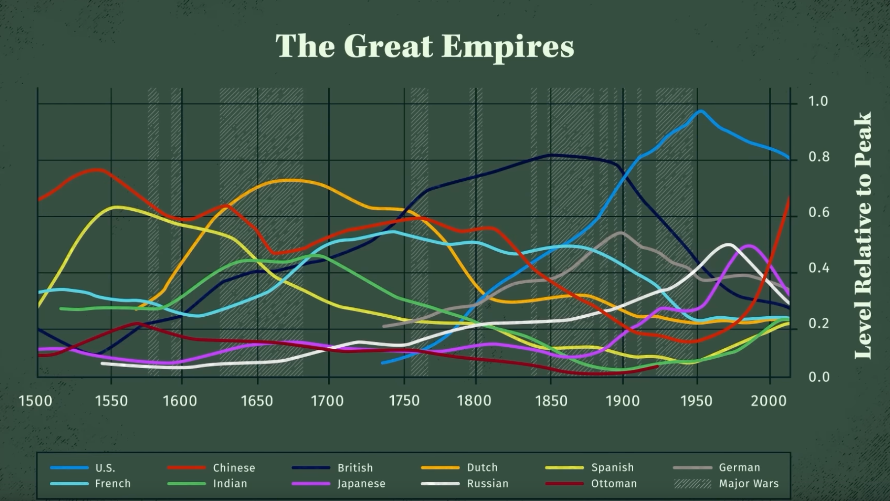
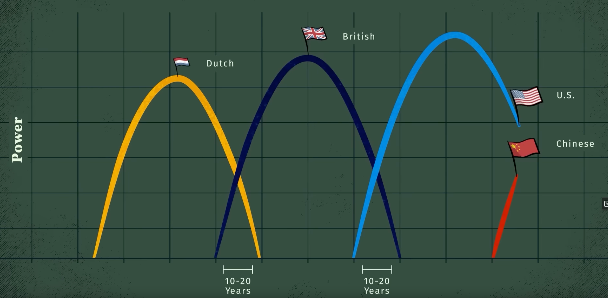

Периодическая функция активации в нейронной сети


## Мотивация

Пока крутые ребята делают ChatGPT-4, GigaChat вернемся к базе. 
Изучая нейронные сети все глубже сталкиваешься с тем, что не ко всем задачам принименимы полносвязные глубокие нейронные сети с класическими слоями Linear и слоями активации Relue + Than. Почему не используют остальные функции в качестве активации например периодические?


### Периодические функции это естественный процесс
В целом, периодические функции являются одной из самых основных функций, важных для человеческого общества и естествознания: суточные и годовые циклы в мире диктуются периодическими движениями солнечной системы.
Человеческому организму присущи биологические часы, которые носят периодический характер, количество пассажиров в метро меняется ежедневно , а фондовый рынок, курс биткоина это все в своем роде периодические последовательности. 
Мировая экономика также следует сложным и накладывающимся друг на друга циклам разных периодов, интересный видеоролик на эту тему есть у Ray Dalio.



Во многих научных сценариях мы хотим смоделировать периодическую систему, чтобы иметь возможность предсказать будущую эволюцию, основываясь на текущих и прошлых наблюдениях. В то время как глубокие нейронные сети являются отличными инструментами для интерполяции между существующими данными, их реализация плохо подходит для экстраполяции за пределы диапазона обучения, особенно для улавливания периодических функций.

# TO DO
## Добавить ПОТОМ когда начнетс периодичность
Если мы заранее знаем, что задача является периодической, мы можем легко решить ее, помощью пребразования Фурье. Однако во многих ситуациях мы априори не знаем, является ли проблема линейно угловой (Relu) периодической или содержит периодический компонент. В таких случаях важно иметь универсальную модель, которая была бы достаточно гибкой для моделирования как периодических, так и непериодических функций, чтобы преодолеть предвзятость при выборе определенного подхода к моделированию. 

Существуют некоторые предыдущие методы, предлагающие использовать функции периодической активации (Fourier neural networks). В предлагается использовать периодические функции, sin(x) и cos(x), или их линейные комбинации в качестве функций активации. Однако такие функции активации очень трудно оптимизировать из-за большого вырождения локальных минимумов и экспериментальные результаты показывают, что использование sin в качестве функции активации работает плохо, за исключением очень простых моделей, и что оно не может конкурировать с функциями активации на основе ReLU о стандартных задача.

## Применение стандартных подходов

Сгенерируем тренировочные и валидационные данные тривальных функций
y=x, y=sin(x), y=tahn(x), y=x^2
Диапазон train data x=[-20;-4] and [4:20]
Пробел в  train data x -4;4 взть чтоб посмотреть на интерполяцию
Диапазон valid data x=[-60;60] валидационная data взята так чтоб посмотреть как себя поведет нейронная сеть на тех диапазонах где данных в принципе нет.


### Code gen data:
```python 
import torch
import matplotlib.pyplot as plt
import matplotlib

class Gen_data:
    def __init__ (self, func, ydown_scale, yup_scale ):
        # Data for train
        x_train = torch.rand(700)
        x_train = x_train * 40.0 - 20.0
        
        self.x_train = x_train[ (x_train <= -4) | (x_train >= 4) ] 
        self.y_train = func(self.x_train)
        
        # Validate data
        self.x_val = torch.linspace(-60, 60, 600)
        self.y_val = func(self.x_val)
        
        # For correct view plottig data
        self.ydown_scale = ydown_scale
        self.yup_scale   = yup_scale

    
    def get_train_unsqueeze(self):
        return torch.unsqueeze(self.x_train, 1), torch.unsqueeze(self.y_train, 1)
    
    def get_val_unsqueeze(self):
        return torch.unsqueeze(self.x_val, 1), torch.unsqueeze(self.y_val, 1)

def plot_initdata(data):
    # generate data
    x_train = data.x_train
    y_train = data.y_train

    x_val = data.x_val
    y_val = data.y_val

    # Plot data
    plt.scatter(x_train.numpy(), y_train.numpy(), s=20, color = "purple", label='Train data')
    plt.plot(x_val,y_val, 'b-', label='Valid data')
    plt.title('$y = x$');

    plt.legend(loc='upper left')
    plt.xlabel('$x$')
    plt.ylabel('$y$')

```
Сами графики:
### code y=x
```python
# Define function
line_func=torch.clone
line_data=Gen_data(line_func, -65,65)
plot_initdata(line_data)
```
### график y=x


### code y=sin(x)
```python
matplotlib.rcParams['figure.figsize'] = (30.0, 5.0)
sin_data = Gen_data(torch.sin, -4,4)
plot_initdata(sin_data)
```
### график y=sin(x)
.png)
### code y=tahn(x)
```python
matplotlib.rcParams['figure.figsize'] = (20.0, 5.0)
tanh_data = Gen_data(torch.tanh, -2,2)
plot_initdata(tanh_data)
```
### график y=tahn(x)
.png)

### code y=x**2
```python
matplotlib.rcParams['figure.figsize'] = (20.0, 10.0)
# Define function
def parabola(x_input):
    return torch.pow(x_input, 2)
parb_data = Gen_data(parabola,-20,400)

plot_initdata(parb_data)
```
### график y=(x)**2
**2.png)

### Создадим  нейронную сеть
Создадим однослойную нейронную сеть с активационным слоем Relu
#### code pytorch Net
```python
import torch.nn as nn
import torch

class Net(torch.nn.Module):
    def __init__(self, n_hidden_neurons):
        super().__init__()
        # YOUR CODE HERE
        self.fc1 = nn.Linear(1, n_hidden_neurons)
        self.act_relu = nn.ReLU() 
        self.fc2 = nn.Linear(n_hidden_neurons, 1)
        pass

    def forward(self, x):
        x = self.fc1(x)
        x = self.act_relu(x)
        x = self.fc2(x)
        return x

def loss(pred, target):
    squares = (pred - target)**2
    return squares.mean()
```


