Периодическая функция активации в нейронной сети


## Мотивация

Пока крутые ребята делают ChatGPT-4, GigaChat вернемся к базе. 
Изучая нейронные сети все глубже сталкиваешься с тем, что не ко всем задачам применимы полносвязные глубокие нейронные сети с класическими слоями Linear и слоями активации Relue + Than. Почему не используют остальные функции в качестве активации например периодические?


### Периодические функции это естественный процесс
В целом, периодические функции являются одной из самых основных функций, важных для человеческого общества и естествознания: суточные и годовые циклы в мире диктуются периодическими движениями солнечной системы.
Человеческому организму присущи биологические часы, которые носят периодический характер, количество пассажиров в метро меняется ежедневно , а фондовый рынок, курс биткоина это все в своем роде периодические последовательности. 
Мировая экономика также следует сложным и накладывающимся друг на друга циклам разных периодов, интересный видеоролик на эту тему есть у Ray Dalio.


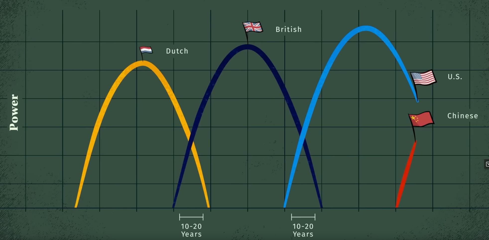
Во многих научных сценариях мы хотим смоделировать периодическую систему, чтобы иметь возможность предсказать будущую эволюцию, основываясь на текущих и прошлых наблюдениях. В то время как глубокие нейронные сети являются отличными инструментами для интерполяции между существующими данными, их реализация плохо подходит для экстраполяции за пределы диапазона обучения, особенно для улавливания периодических функций.

# TO DO
## Добавить ПОТОМ когда начнетс периодичность
Если мы заранее знаем, что задача является периодической, мы можем легко решить ее, помощью пребразования Фурье. Однако во многих ситуациях мы априори не знаем, является ли проблема линейно угловой (Relu) периодической или содержит периодический компонент. В таких случаях важно иметь универсальную модель, которая была бы достаточно гибкой для моделирования как периодических, так и непериодических функций, чтобы преодолеть предвзятость при выборе определенного подхода к моделированию. 

Существуют некоторые предыдущие методы, предлагающие использовать функции периодической активации (Fourier neural networks). В предлагается использовать периодические функции, sin(x) и cos(x), или их линейные комбинации в качестве функций активации. Однако такие функции активации очень трудно оптимизировать из-за большого вырождения локальных минимумов и экспериментальные результаты показывают, что использование sin в качестве функции активации работает плохо, за исключением очень простых моделей, и что оно не может конкурировать с функциями активации на основе ReLU о стандартных задача.

## Применение стандартных подходов

Сгенерируем тренировочные и валидационные данные тривальных функций
y=x, y=sin(x), y=tahn(x), y=x^2
Диапазон train data x=[-20;-4] and [4:20]
Пробел в  train data x [-4;4] поможет иследовать способность сети к **интерполяции**
Диапазон valid data x=[-60;60] валидационная data взята так чтоб посмотреть как себя поведет нейронная сеть на тех диапазонах где данных в принципе нет, с помощью этого иследуем **эксторпаляцию**.


### Code gen data:
```python 
import torch
import matplotlib.pyplot as plt
import matplotlib

class Gen_data:
    def __init__ (self, func, ydown_scale, yup_scale ):
        # Data for train
        x_train = torch.rand(700)
        x_train = x_train * 40.0 - 20.0
        
        self.x_train = x_train[ (x_train <= -4) | (x_train >= 4) ] 
        self.y_train = func(self.x_train)
        
        # Validate data
        self.x_val = torch.linspace(-60, 60, 600)
        self.y_val = func(self.x_val)
        
        # For correct view plottig data
        self.ydown_scale = ydown_scale
        self.yup_scale   = yup_scale

    
    def get_train_unsqueeze(self):
        return torch.unsqueeze(self.x_train, 1), torch.unsqueeze(self.y_train, 1)
    
    def get_val_unsqueeze(self):
        return torch.unsqueeze(self.x_val, 1), torch.unsqueeze(self.y_val, 1)

def plot_initdata(data):
    # generate data
    x_train = data.x_train
    y_train = data.y_train

    x_val = data.x_val
    y_val = data.y_val

    # Plot data
    plt.scatter(x_train.numpy(), y_train.numpy(), s=20, color = "purple", label='Train data')
    plt.plot(x_val,y_val, 'b-', label='Valid data')
    plt.title('$y = x$');

    plt.legend(loc='upper left')
    plt.xlabel('$x$')
    plt.ylabel('$y$')

```
Сами графики:
### code y=x
```python
# Define function
line_func=torch.clone
line_data=Gen_data(line_func, -65,65)
plot_initdata(line_data)
```
### график y=x
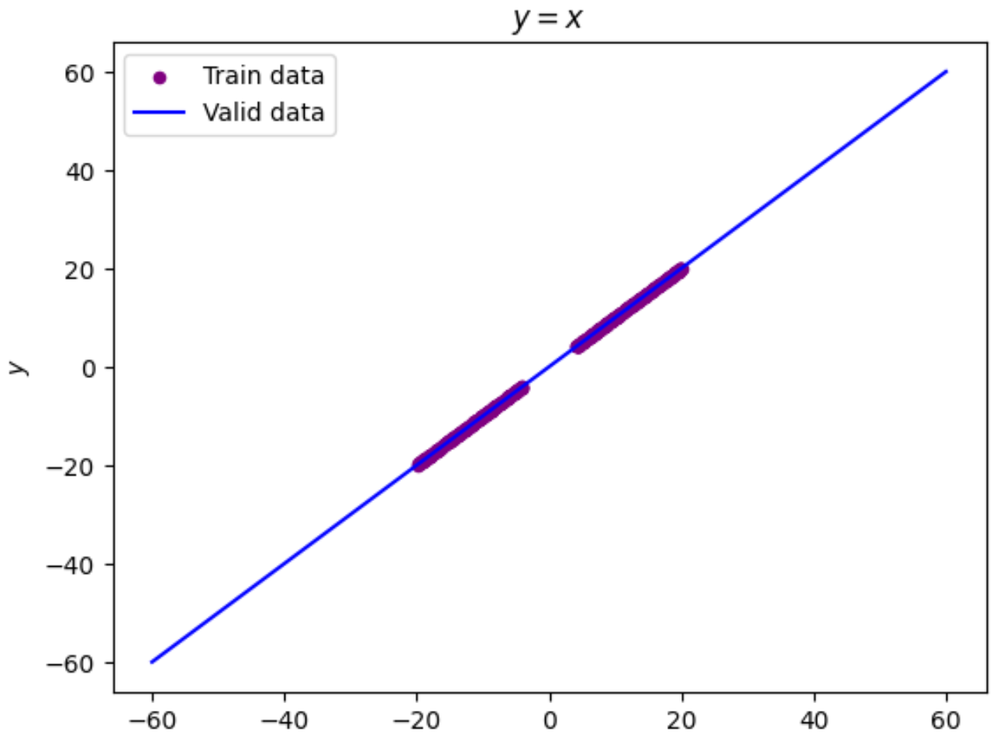

### code y=sin(x)
```python
matplotlib.rcParams['figure.figsize'] = (30.0, 5.0)
sin_data = Gen_data(torch.sin, -4,4)
plot_initdata(sin_data)
```
### график y=sin(x)
.png)
### code y=tahn(x)
```python
matplotlib.rcParams['figure.figsize'] = (20.0, 5.0)
tanh_data = Gen_data(torch.tanh, -2,2)
plot_initdata(tanh_data)
```
### график y=tahn(x)
.png)

### code y=x**2
```python
matplotlib.rcParams['figure.figsize'] = (20.0, 10.0)
# Define function
def parabola(x_input):
    return torch.pow(x_input, 2)
parb_data = Gen_data(parabola,-20,400)

plot_initdata(parb_data)
```
### график y=(x)**2
**2.png)

### Создадим  нейронную сеть
Создадим однослойную полносвязную нейронную сеть с 1 скрытым слоем из 512 нейронов и активационным слоем Relu
#### code pytorch Net
```python
import torch.nn as nn
import torch

class Net(torch.nn.Module):
    def __init__(self, n_hidden_neurons):
        super().__init__()
        # YOUR CODE HERE
        self.fc1 = nn.Linear(1, n_hidden_neurons)
        self.act_relu = nn.ReLU() 
        self.fc2 = nn.Linear(n_hidden_neurons, 1)
        pass

    def forward(self, x):
        x = self.fc1(x)
        x = self.act_relu(x)
        x = self.fc2(x)
        return x

def loss(pred, target):
    squares = (pred - target)**2
    return squares.mean()
```

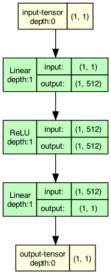


## Будем тренировать данную сеть на наших заготовленных данных:

### Результат на функции y=x
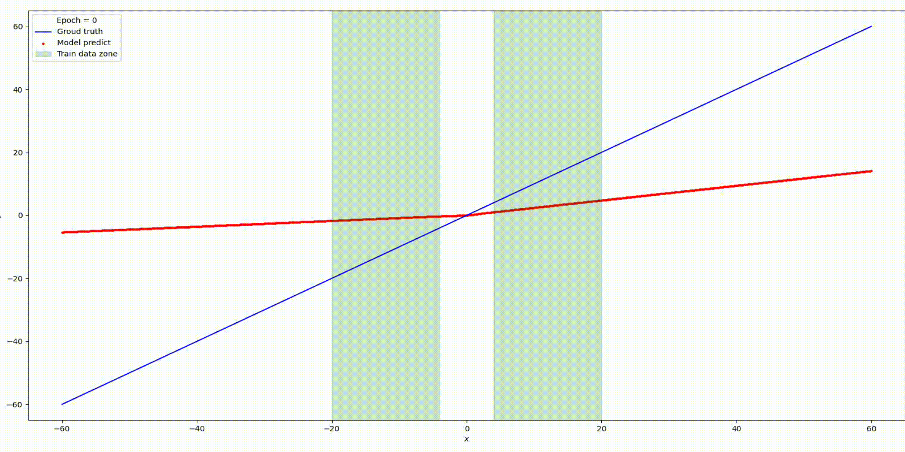

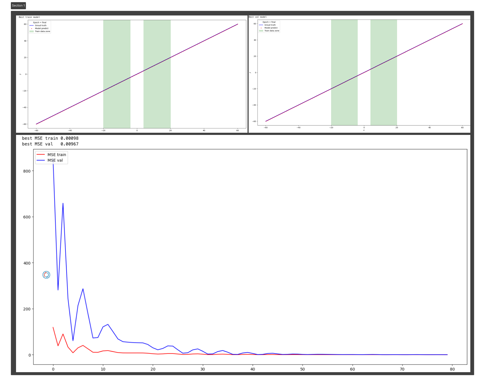
### Результат на функции y=sin(x)

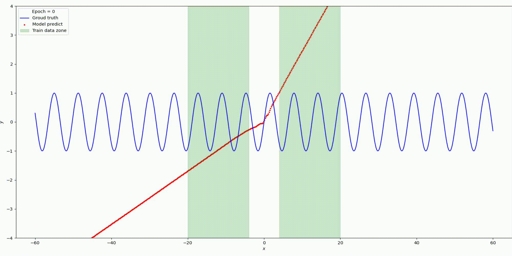
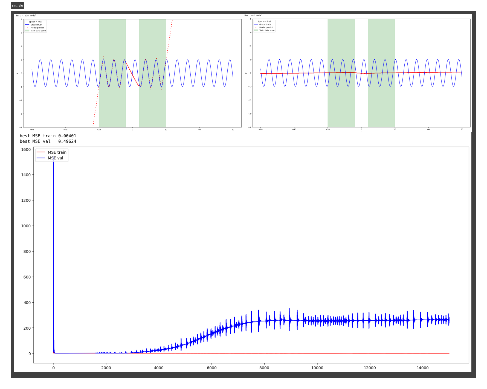
### Результат на функции y=tanh(x)
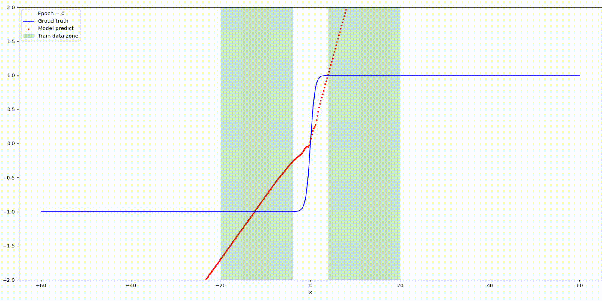
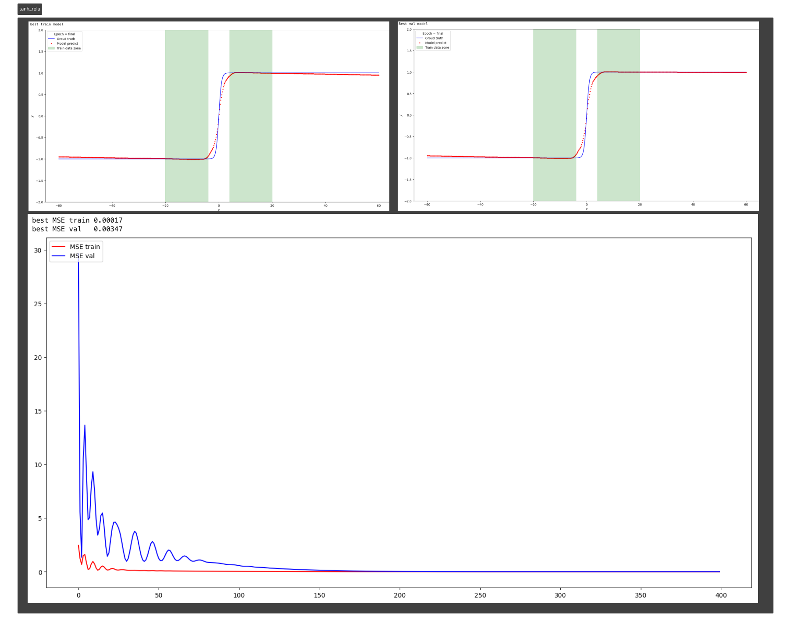
### Результат на функции y=parab(x)
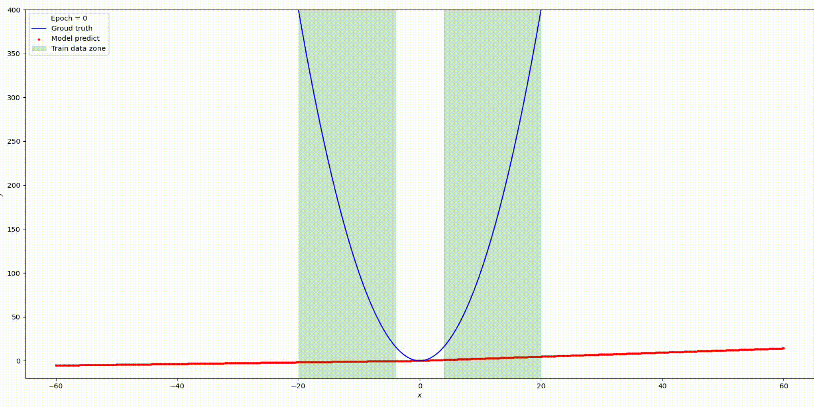
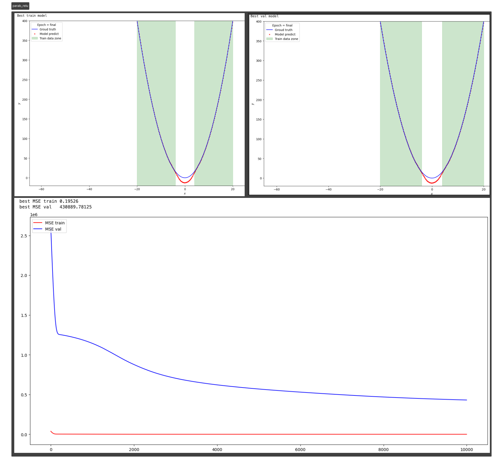
Для начала вспомним как выглядит функция активации Relu:

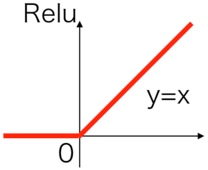
 В статье https://arxiv.org/pdf/2006.08195.pdf приводятся две теоремы   тк они подобны приведу одну.
 ## Теорема: 
 Расмативая сети прямой связи  f(relu(x)) с произвольной но фиксированной глубиной и шириной d_1, .... d_h+1

 $$ \lim_{z\to\infty} || f_{ReLU}(zu)-zW_{u}u-b_{u}||_{2}=0$$
 где z есть вещественный скаляр, u - любой единичный вектор размерности d1 а Wu ∈ Rd1×dh - постоянная матрица, зависящая только от u.
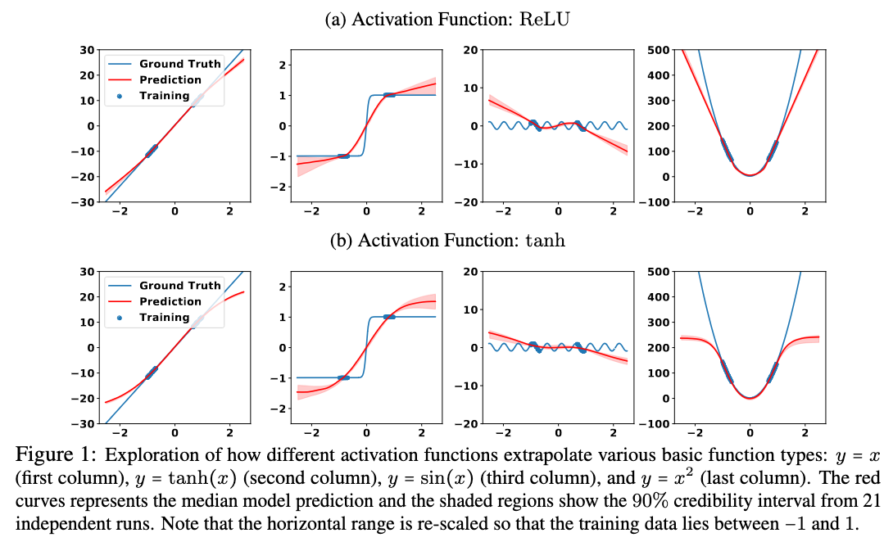


Приведенная выше теорема гласит, что любая нейронная сеть прямого действия с активацией ReLU сходится к линейному преобразованию Wu в асимптотическом пределе, и это экстраполированное линейное преобразование зависит только от u, направления экстраполяции. Смотрите иллюстрацию. 

Т.е как понимаю это я. Данная архитектура сети Linear(Relu) способна только находить периодические зависимости в пределах существующего диапазона данных при достаточном колличестве нейронов и глубине сети. Но никак не может обобщать периодические завимости в  местах пространсва где данные отсутсвуют.
Такое-же обобщение теоремы работает для фкнкций активации как Tahn() Swish() и Leaky-ReLU()  подобным образом как Relu.

Как мы видели в предыдущем разделе, выбор функций активации играет решающую роль в  интерполяции и экстраполяции в нейронных сетях и такие свойства интерполяции
и экстраполяции, в свою очередь, влияют на обобщение способности сети.

Мотивация выбора периодичной функции активации.
На ум сразу приходит взять в качестве активационной функции y=sin(x) или y=cos(x)
Однако проблема этих функций заключается не в их способности к обобщению, а в
их оптимизации. На самом деле, sin не является монотонной функцией, и использование
sin в качестве функции активации создает бесконечно много локальных минимумов
в решениях (поскольку сдвиг значения предварительной активации на 2π дает
та же функция), что затрудняет оптимизацию sin.
Тоесть нам нужна какая-то модифицированная sin(x) наклонная функция
$$\Large \operatorname{Snake}_a:=x+\frac{1}{a} \sin ^2(a x)$$
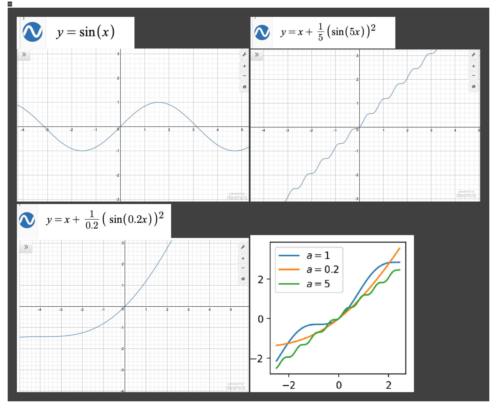

Имплеминтируем в pytorch:

```python
import torch 
from torch import nn, sin, pow
from torch.nn import Parameter
from torch.distributions.exponential import Exponential

class Snake(nn.Module):
    '''         
    Implementation of the serpentine-like sine-based periodic activation function:
    .. math::
         Snake_a := x + \frac{1}{a} sin^2(ax) = x - \frac{1}{2a}cos{2ax} + \frac{1}{2a}
    This activation function is able to better extrapolate to previously unseen data,
    especially in the case of learning periodic functions

    Shape:
        - Input: (N, *) where * means, any number of additional
          dimensions
        - Output: (N, *), same shape as the input
        
    Parameters:
        - a - trainable parameter
    
    References:
        - This activation function is from this paper by Liu Ziyin, Tilman Hartwig, Masahito Ueda:
        https://arxiv.org/abs/2006.08195
        
    Examples:
        >>> a1 = snake(256)
        >>> x = torch.randn(256)
        >>> x = a1(x)
    '''
    def __init__(self, in_features, a=None, trainable=True):
        '''
        Initialization.
        Args:
            in_features: shape of the input
            a: trainable parameter
            trainable: sets `a` as a trainable parameter
            
            `a` is initialized to 1 by default, higher values = higher-frequency, 
            5-50 is a good starting point if you already think your data is periodic, 
            consider starting lower e.g. 0.5 if you think not, but don't worry, 
            `a` will be trained along with the rest of your model
        '''
        super(Snake,self).__init__()
        self.in_features = in_features if isinstance(in_features, list) else [in_features]

        # Initialize `a`
        if a is not None:
            self.a = Parameter(torch.ones(self.in_features) * a) # create a tensor out of alpha
        else:            
            m = Exponential(torch.tensor([0.1]))
            self.a = Parameter((m.rsample(self.in_features)).squeeze()) # random init = mix of frequencies

        self.a.requiresGrad = trainable # set the training of `a` to true

    def forward(self, x):
        '''
        Forward pass of the function.
        Applies the function to the input elementwise.
        Snake ∶= x + 1/a* sin^2 (xa)
        '''
        return  x + (1.0/self.a) * pow(sin(x * self.a), 2)
```

### Сама нейронная сеть c функцией Snake:
```python
import torch.nn as nn
# from activations_snake import Snake


class SnakeNet(torch.nn.Module):
    def __init__(self, n_hidden_neurons,alpha):
        super().__init__()
        # YOUR CODE HERE
        self.fc1 = nn.Linear(1, n_hidden_neurons)
        self.act_snake = Snake(n_hidden_neurons, alpha) 
        self.fc2 = nn.Linear(n_hidden_neurons, 1)
        pass

    def forward(self, x):
        x = self.fc1(x)
        x = self.act_snake(x)
        x = self.fc2(x)
        return x

    
def loss(pred, target):
    squares = (pred - target)**2
    return squares.mean()
```

## Parametrs
n_hidden_neurons=512, alpha=20, epochs=20000, lr= 0.001.
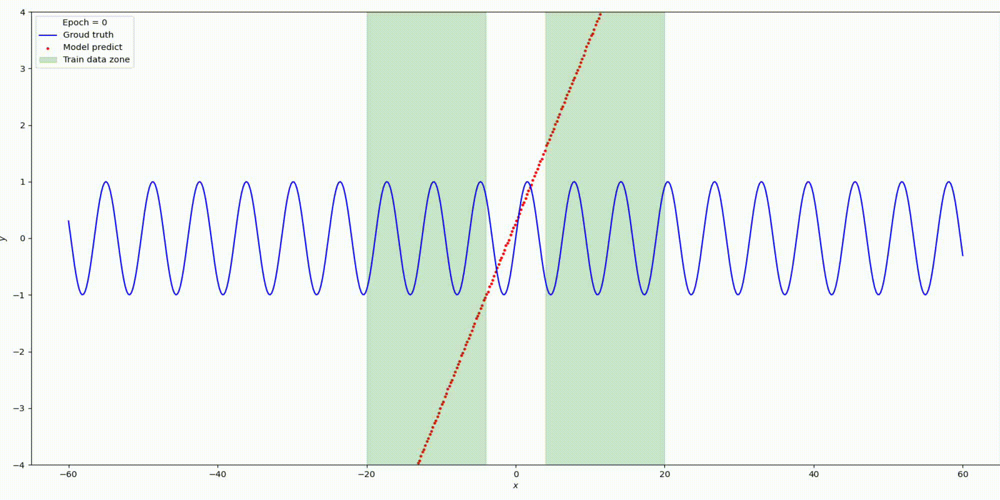
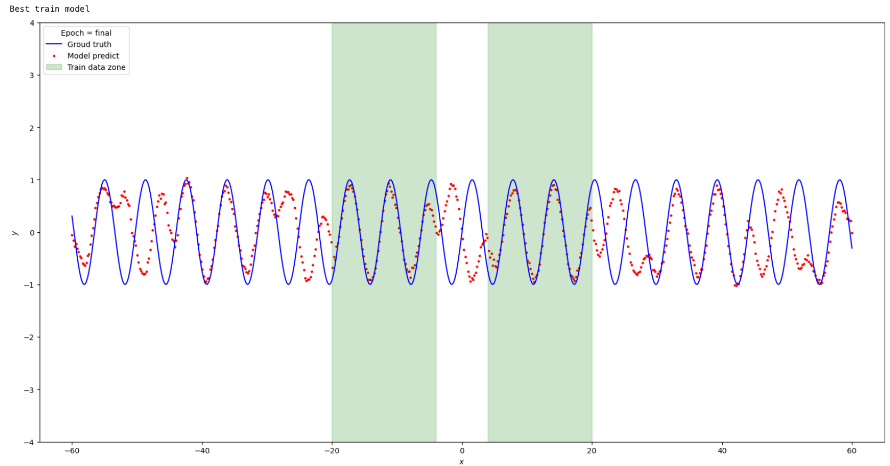

Изменим гипер-параметры
n_hidden_neurons=5, alpha=2, epochs=1500, lr= 0.0001.
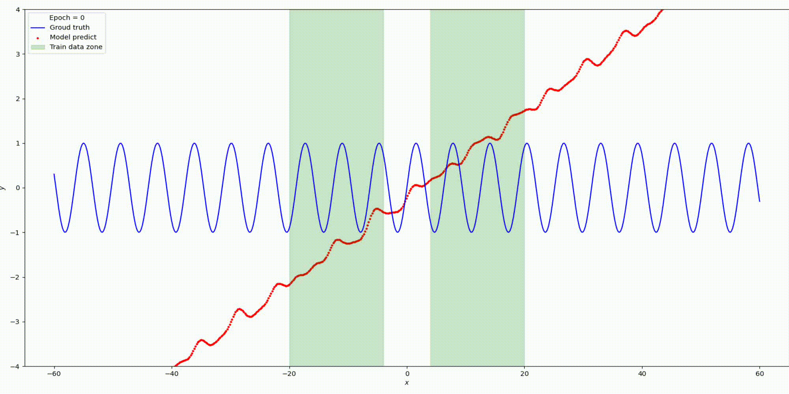

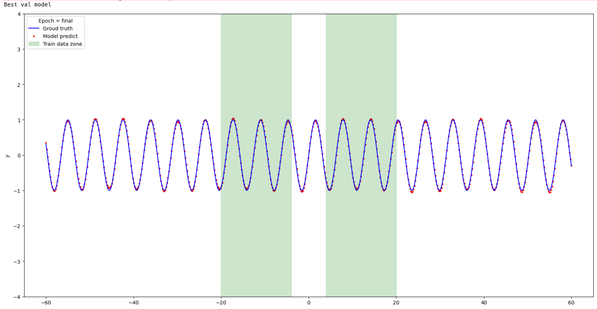

Сравним результаты Relu vs Snake на функции y=sin(x)
|                 | Relu neuron=500  | Snake neuron=4, alpha=2 |
|-----------------|------------------|-------------------------|
| best MSE val    | 0.49617          | 0.00119                 |


